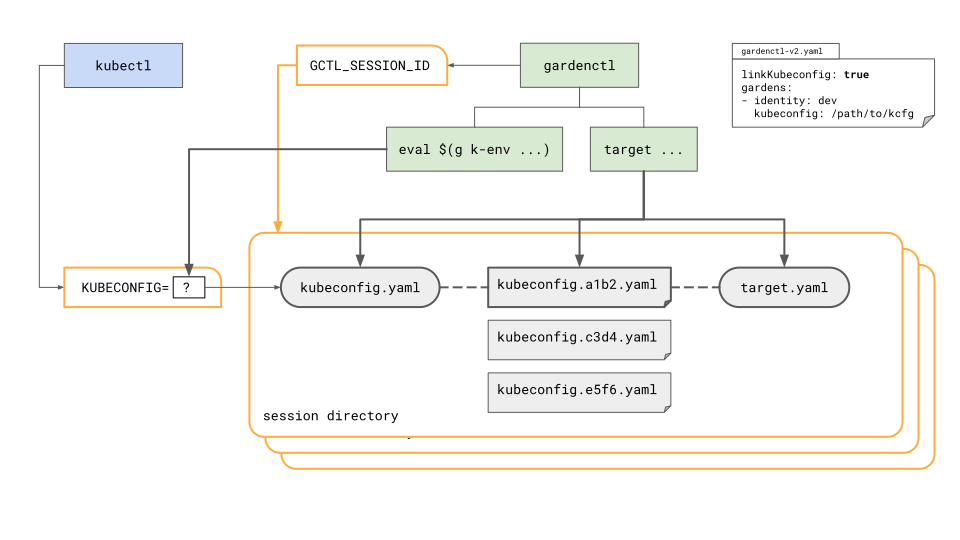
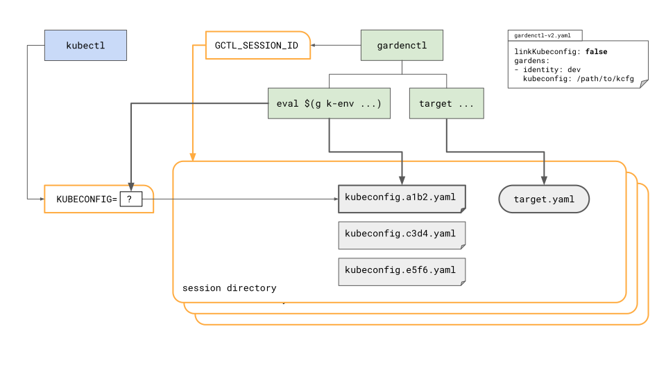

# Interaction with other command-line tools

## [kubectl](https://kubernetes.io/docs/reference/kubectl/kubectl/)
It is possible to change the target cluster of `kubectl` directly with the [`gardenctl target ...`](../help/gardenctl_target.md) command without having to adjust the [`KUBECONFIG`](https://kubernetes.io/docs/reference/kubectl/kubectl/#environment-variables) environment variable again and again. 
Whether the current target cluster of `gardenctl` and `kubectl` should be synchronized or not can be set using the configuration property `linkKubeconfig` or the `GCTL_LINK_KUBECONFIG` environment variable.

#### Behavior with symlink
```yaml
linkKubeconfig: true
```
The `target` command changes the current target cluster of `gardenctl`, downloads the corresponding kubeconfig file and creates a stable symlink to the current kubeconfig file in the session directory.
If the target is changed the symlink points to the new target but the `KUBECONFIG` environment variable does not need to be changed. 
The `kubectl-env` command now does nothing except creating the script to set the `KUBECONFIG` environment variable. 
This even works if nothing is targeted and could be done in the shell profile.

The generated script only needs to be evaluated once per shell session and looks something like this:
```bash
export KUBECONFIG=$TMPDIR/garden/$GCTL_SESSION_ID/kubeconfig.yaml
```

#### Behavior without symlink
```yaml
linkKubeconfig: false
```
The `target` command only changes the current target cluster of `gardenctl`, but does not download the corresponding kubeconfig file. 
This happens only when the `kubectl-env` command is executed. If the user evaluates the generated script the `KUBECONFIG` environment variable points the downloaded kubeconfig file for the targeted cluster.

The generated script looks something like this:
```bash
export KUBECONFIG=$TMPDIR/garden/$GCTL_SESSION_ID/kubeconfig.<hash>.yaml
```