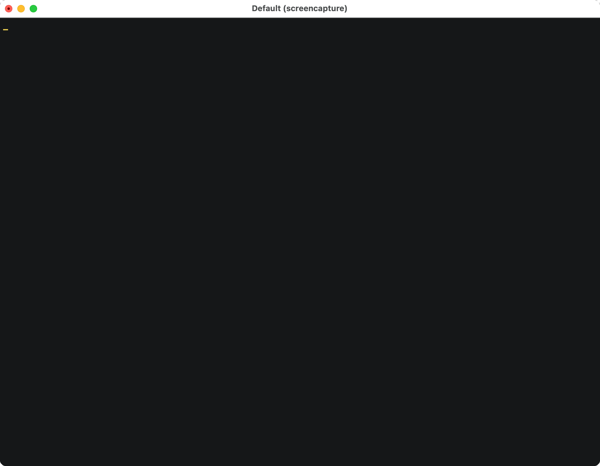

# Access Restrictions

Gardenctl can be configured with access restrictions.



When a user accesses a cluster with access restrictions a notification is shown. The user is prompted to
confirm access with `Yes` or he can cancel the action with `No`.

Access restrictions are shown for regions that have a matching label in the `CloudProfile`

```yaml
  regions:
  - name: pangaea-north-1
    zones:
    - name: pangaea-north-1a
    - name: pangaea-north-1b
    - name: pangaea-north-1c
    labels:
      seed.gardener.cloud/eu-access: "true"
```

Access restrictions are shown for clusters where the property `spec.seedSelector.matchLabels[key]` is set 
and access restrictions options are shown the annotation `metadata.annotations[optionKey]` is set.

```yaml
apiVersion: core.gardener.cloud/v1beta1
kind: Shoot
metadata:
  annotations:
    support.gardener.cloud/eu-access-for-cluster-addons: "true"
    support.gardener.cloud/eu-access-for-cluster-nodes: "true"
  ...
spec:
  seedSelector:
    matchLabels:
      seed.gardener.cloud/eu-access: "true"
```

**Configuration**

In order for gardenctl to display access restrictions, they must be configured as described below.
Access restrictions must be configured separately for each garden. 
The configuration structure is identical to the structure from gardenctl v1.
But if you want to use the same access restriction configuration for all you can do this by using [YAML anchors and aliases](https://yaml.org/spec/1.2.2/#alias-nodes).
The example below shows how a single confiugration can be used for several different Gardens.

```yaml
sharedAccessRestrictions: &accessRestrictions
- key: seed.gardener.cloud/eu-access
  notifyIf: true
  msg: |-
    Do not migrate the cluster to a data center outside the 
    EEA or Switzerland without the customer's prior written 
    consent (email permitted).
    The service is offered with the regular SLAs and 24x7 
    support for the control plane of the cluster. 
    24x7 support for cluster add-ons and nodes is only 
    available if the user complies to the conditions
  options:
  - key: support.gardener.cloud/eu-access-for-cluster-addons
    notifyIf: true
    msg: |-
      Do not access cluster add-ons such as DNS and certificates,
      Calico overlay network and network policies, 
      kube-proxy and services, and everything else that would 
      require direct inspection of the cluster through its 
      API server in case you are not located in EEA.
      Only third-level/dev support at usual 8x5 working hours 
      in EEA does apply in this case
  - key: support.gardener.cloud/eu-access-for-cluster-nodes
    notifyIf: true
    msg: |-
      Do not access all node-related components such as Docker 
      and Kubelet, the operating system, and everything else that 
      would require direct inspection of the nodes through 
      a privileged pod or SSH in case you are not located in EEA. 
      Only third-level/dev support at usual 8x5 working hours 
      in EEA does apply in this case
gardenClusters:
  - identity: my-landscape-live
    kubeconfig: /path/to/live/kubeconfig
    ...
    accessRestrictions: *accessRestrictions
  - identity: my-landscape-canary
    kubeconfig: /path/to/canary/kubeconfig
    ...
    accessRestrictions: *accessRestrictions
...
```

If you don't want to have an access restriction configuration you don't have to delete configuration. 
You can simply point the YAML anchor `&accessRestrictions` to an empty node.

```diff
+ noAccessRestrictions: &accessRestrictions ~
- sharedAccessRestrictions: &accessRestrictions
+ sharedAccessRestrictions:
```
