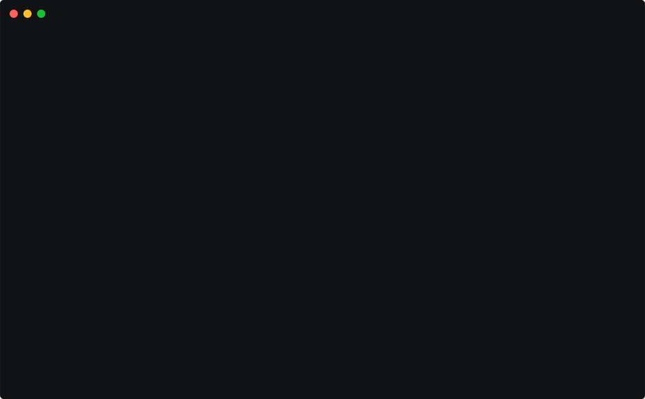

# Access Restrictions

Gardenctl can be configured with access restrictions.



When a user accesses a cluster with access restrictions, a notification is shown. The user is prompted to
confirm access with `Yes` or to cancel the action with `No`.

Access restrictions are shown for clusters where the property `spec.accessRestrictions[].name` is set,
and options for the access restrictions are shown when `spec.accessRestrictions[].options` is set.

```yaml
apiVersion: core.gardener.cloud/v1beta1
kind: Shoot
spec:
  accessRestrictions:
  - name: eu-access-only
    options:
      support.gardener.cloud/eu-access-for-cluster-nodes: 'true'
```

**Configuration**

For `gardenctl` to display access restrictions, they must be configured as described below.
Access restrictions must be configured separately for each garden.


```yaml
gardens:
...
- identity: my-landscape-live
  kubeconfig: /path/to/live/kubeconfig
  accessRestrictions:
  - key: eu-access-only
    msg: |-
      Do not migrate the cluster to a data center outside the 
      EEA or Switzerland without the customer's prior written 
      consent (email permitted).
      The service is offered with the regular SLAs and 24x7 
      support for the control plane of the cluster. 
      24x7 support for cluster add-ons and nodes is only 
      available if the user complies to the conditions
    options:
      - key: support.gardener.cloud/eu-access-for-cluster-nodes
        notifyIf: true
        msg: |-
          Do not access all node-related components such as Docker 
          and Kubelet, the operating system, and everything else that 
          would require direct inspection of the nodes through 
          a privileged pod or SSH in case you are not located in EEA. 
          Only third-level/dev support at usual 8x5 working hours 
          in EEA does apply in this case
```
